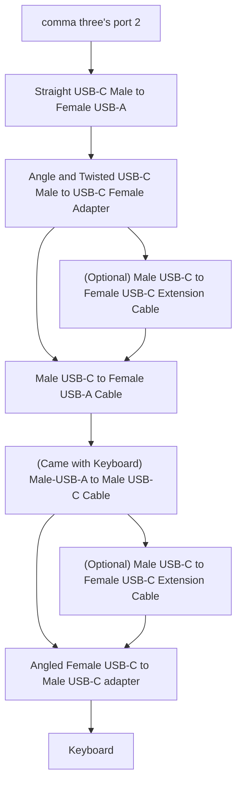

# 🦾 comma three Faux-Touch keyboard

*Long arms for those of us with short arms from birth or those who can't afford arm extension surgery!*


These are instructions and firmware for a relatively cheap off-the-shelf macro keyboard off AliExpress/Amazon (that has many copies/clones) to control a comma three running openpilot from an accessible and comfortable driver's position.

No more this and reaching out when you want to bookmark a segment or toggle experimental mode:


The macro keyboard we will be using look like this and come in this configuration:


The default configuration software and firmware on these kinds of keyboards is notoriously bad, sketchy in origin, and may not be trustworthy. Most importantly, it won't work for our use case where we need to send touchscreen input. So, don't bother downloading and don't install the configuration software. We will be throwing it all out.

Instead, we flash the keyboard's microprocessor to pretend to be a USB touchscreen digitizer, and the buttons to send touch events to the comma three. The new firmware touch areas are currently hardcoded to the bottom left corner for bookmark, the slight-left of center for hide/show menu, and the top right corner for experimental mode toggling. The knob is used to control the LEDs to be a "lamp" light for night driving use and pressing down on it is an alternative button for the top right corner button pressing.

**A limitation of the blind touch approach is that I don't think this might work for the comma prime navigation UI. I don't have comma prime to develop against and that issue is being tracked in this issue: https://github.com/nelsonjchen/c3-touchkey-keyboard/issues/2 .**

These keyboards are built around the [`CH552G`][ch552info] microcontroller. By shorting two pins together on initial power, the keyboard can be put into bootloader mode, and the new touchscreen-emulation firmware can then be flashed over USB.

Restoring the original vendor firmware is not possible without  the original vendor firmware which I haven't been able to find yet. That said, somewhat similar functional firmware to the original functionality without the sketchy vendor software can be found here if you want to "reverse" the process and restore the keyboard to something like its original functionality:

https://github.com/biemster/3keys_1knob

A more hardcore keyboard framework for this chip exists here as well:

https://github.com/semickolon/fak

## Bill of Materials

Cost: Expect the cost to be about $3-20 for the keyboard, $2-10 for the male USB-C to female USB-A adapter, and an optional $6-10 for nicities like 90 degree USB-C angle adapters for a cleaner look. You may also need a USB-C extension cable. The rest of the materials you probably have lying around. The cost can be $14 to $40 depending on how long you want to wait for the materials to arrive from AliExpress, if you're in a hurry and want to buy from Amazon, or how clean you want the install to look.

### Keyboard


A specific type of mass-produced macro keyboard with a [`CH552G`][ch552info] microcontroller. The one this project supports and what I used was this:

* https://www.aliexpress.us/item/3256806441586710.html

  * Note that sometimes these keyboards are on sale for $5 from vendors.
  * https://www.aliexpress.us/item/3256806441586710.html
  * 

* https://amzn.to/3Q7Mw5c

Go for AliExpress if you want to save money and don't mind waiting. Go for Amazon if you want it faster and have Prime.

As there are many vendors of this keyboard, there is no steady name other than a similar look, so keep an eye for these traits when looking for an equivalent keyboard:

* Looks like the keyboard in those links I have above.
* Shows up when you search for "3 keys 1 knob keyboard"
* 3 keys in a row
* 1 knob, metal-looking usually
* Acryllic layered construction with rounded corners
* Exposed screws heads on bottom and top
* Multi-color LEDs
* USB-C is offset a bit torwards the knob side of the keyboard and not in the center.
* Comes with a male USB-A to male USB-C cable
* No wireless.
* A link to a sketchy file hosting site for configuration software, "email us for software" call to action, or even **no** instruction
* Has a black or white variant. Color doesn't matter, choose your preference.
* Tends to come with red switches

These will usually guarantee you get a keyboard with the `CH552G` microcontroller present in the manner we need.

The keyboard will also come with a 1 meter long male USB-A to male USB-C cable.

#### Optional Customizations

It is a mechanical keyboard! You can replace the stock red switches with whatever you like along with the keycaps. Tactile switch replacement is popular. Keycaps/Switches are also sold on Amazon, AliExpress, and wherever you want to buy them. You might spend more on switches and keycaps than the keyboard.

### Male USB-C to Female USB-A cable

Unfortunately, the keyboard is not perfect. It is missing two resistors in it that allow it to be powered by a USB-C port in a USB-C to USB-C setup. However, we need to power it from the comma three's USB-C port. While it is theoretically possible to solder in the right resistors, it is easier to just use a cable to convert the comma three USB-C port to a USB-A port. The longer, the better and here are some examples:

* https://amzn.to/4aFOj9I

* https://www.aliexpress.us/item/3256806084714064.html

### Right Angle Adapters

These are optional, but they help reduce cable strain on the cable at the comma three's USB-C port and clean up the cables in the area with the keyboard attached to your car.

* https://amzn.to/3U3WtSu - This is a pack of 5 adapters with 3 of them being useful to get the angles right to reduce strain and clean up the cables.
* https://www.aliexpress.us/item/3256805061903701.html
  * Purchase "Color": 1, 4, 5

### Male USB-C to Female USB-C Extension Cable

This is optional. Without it, the setup barely fits in my Corolla. If you got the 5 pack of adapters from Amazon above, there's a female to female adapter you can use to extend the cable with a male USB-C to male USB-C cable alternatively if you'll like.

Search on Amazon or AliExpress for "USB-C extension cable".

### Mounting Tape

You can attach the keyboard to your car however you like. I used large 3M Command Picture Hanging Strips to attach the keyboard in front of my gear shifter. They are strong enough to hold the keyboard in place and can be fully removed without damaging the car. The strips are also velcro-like so you can remove the keyboard to change it or reprogram it away from the car without disturbing the tape too.

https://amzn.to/49Nm87A

Of course, you can use whatever else you like for mounting.

AliExpress has command strip-like products as well, but I haven't tried them yet:

https://www.aliexpress.us/w/wholesale-3m-command-picture-hanging-strips.html

### Shorting Tools

Some tape can be helpful in covering up stuff you don't want to short out on the keyboard. This is optional.

## Instructions

### (Windows) Preparing your Windows computer to flash

You will need to use Zadig to make the device when it is in bootloader mode available to flashing software.

1. Download Zadig from https://zadig.akeo.ie/
2. Run Zadig
3. Under devices, select `Create New Device`.
   1. 
4. Fill in three fields. The first field is just a description and you can fill in anything. The next two fields are very important. Fill them in with 4348 and 55e0 respectively. Press "Install Driver" and give it a few minutes to install.
   1. 

If you still have issues, try other machines, Macs, Linux machines, Chromebooks, or even an Android phone.

### (Ubuntu Linux) Preparing Ubuntu Linux to allow the device to flash via a Chromium-based browser

You will need to create a udev rule to allow your user account to access the device when it is in bootloader mode.

1. Open a terminal and enter the following commands to create the udev rule:

```bash
sudo tee /etc/udev/rules.d/50-ch552-flash.rules <<EOF
# CH552G Bootloader
SUBSYSTEMS=="usb", ATTRS{idVendor}=="4348", ATTRS{idProduct}=="55e0", GROUP="plugdev", MODE="0666"
EOF
```

2. Reload the udev rules:

```bash
sudo udevadm control --reload-rules
```

3. Ensure your user account is part of the `plugdev` group:

```bash
sudo usermod -a -G plugdev $USER
```

4. Log out and log back in for the group change to take effect.

### Android can flash too!

You can flash from an Android device too. No special instructions are needed but things are a tad less visible.

### Getting the keyboard into bootloader mode

1. Prepare the cable from your computer or phone to the keyboard. Make sure that you have a female USB-A port coming *out* of your computer or phone from which you can plug in the keyboard's included male USB-A to USB-C cable. Without this, the keyboard will not power on. You should have these materials from the Bill of Materials section.
2. Put the USB-C end of that setup next to the keyboard.
3. Disassemble the keyboard. There are 4 screws on the back of the keyboard. Keep one of the screws handy for the next steps.
4. Unscrew them and take off the bottom. There will be an acrylic cut out. You will see the `CH552G` microcontroller.
5. Take out the acrylic cut out so you have a bit more space
6. Put the keyboard on its back atop a soft surface like a mousepad or a towel.
7. Ensure you can can see `R12` resistor pad.
8. If you'll like, you can also tape up the other pads and components around the `R12` resistor pad to prevent shorting them out. This is optional.
9. Using one of the 4 screws you unscrewed from the bottom, put the screw's head atop where the `R12` resistor would have been. See these photos as a reference:
   * 
   * My pushing position
     * 
   * Another user's pushing. They chose to tape up the other unrelated components/pads for extra safety.
     * 
10. Push the screw down **hard** so the keyboard isn't moving atop the soft surface.
11. While the `R12` pads are shorted together, plug the USB-C cable into the keyboard.
12. Remove the shorting screw after the keyboard is plugged in.
13. Check if the keyboard shows up in Device Manager as a `WinChipHead` or `CH552` or whatever device you've named it as in Zadig. On Linux, use `lsusb` to check for a `WinChipHead` device. On macOS, open the `System Information` app and check the USB section. You can check on Android by visiting the web flasher at https://www.stephenkingston.net/CH55x-WebProgrammer/ and pressing Connect.

The steps above may be tricky, and you may need to do it a few times.

### Flashing the firmware

After the keyboard is in bootloader mode, you can flash the firmware.

1. Switch to a Chromium-based browser on your computer or phone.
2. Download the `touch.hex` firmware to be flashed from the [GitHub Releases page](https://github.com/nelsonjchen/c3-touchkey-keyboard/releases).
3. Visit https://www.stephenkingston.net/CH55x-WebProgrammer/ . If you're on Android, you were already there.
4. Press Connect
5. Select the device with "Unknown device \[4348:55e0\]" or "`WinChipHead`" or similar in the name from the dropdown.
   * If you don't see your device, try again with getting the device into bootloader mode.
6. Once connected, you should see a message about a "Bootloader Version".
7. Press Upload and select the `.hex` file from the file picker or drop the `.hex` file into the web page and it'll immediately start flashing.
8. Once it's done flashing, you should notice that pressing the keys now causes a light to light up on the keyboard.

### Testing your work

Connect the keyboard to the comma three and test the buttons and knob. Start the car, with the engine not running. The bottom left corner should bookmark, the center should hide/show the side menu, and the top right corner should toggle experimental mode (if available). The knob should control the LEDs and pressing down on the knob should act as an alternative button for the top right corner.

### Keyboard Reassembly

Put it back together, screw it down, and you're done!

### Install into car

Pretend it's like a dashcam install, which you should have done with the comma three. Use the mounting tape to attach the keyboard to a convenient location. I put mine in front of the gear shifter. Connect the cables. Use the right angle adapters to clean up the cable routing, reduce strain on the comma three's USB-C port and minimize any weird blocking of the cameras or interior.

I ran my cable down the passenger side A pillar under the trim.

#### Install Photos

##### Mine


With switch replacements

https://github.com/nelsonjchen/c3-faux-touch-keyboard/assets/5363/e2c270e9-285f-4de6-962e-13900b545120

##### Others

On a Chevy Bolt. Custom Keycaps and "Holy Panda" switches.


On a Chevy Volt.


### Installation Diagram

This is my installation, but you should adjust it to your needs.



## Updating the firmware with the new firmware

If you ever need to update the firmware with the new firmware, the old firmware can be put into bootloader mode by holding the key furthest away from the knob while plugging it into the computer. All the LEDs should light up in full white when this is done. The new firmware can then be flashed without shorting the pins using the web flasher.

## Development

See the Makefile and try to get `make flash` going. You'll need sdcc, Python with pyusb, and build tools.

`sudo libinput debug-events` is your friend. You may need to `apt update -y` and `apt install -y libinput-tools` to get it.

## Inspirations and References

This firmware is based on the work of the following projects:

* https://github.com/biemster/3keys_1knob/ - Showed me the possibility of flashing these keyboards and some implementation reference.
* https://github.com/wagiminator/MCU-Templates - the basis for `3keys_1knob` and a good reference for clean CH55X code.

## License

CC-BY-SA 3.0 as it is mostly based on https://github.com/wagiminator/MCU-Templates/blob/main/CH552/LICENSE . See LICENSE.md for more details.

[ch552info]: https://hackaday.com/2019/02/17/how-to-program-a-really-cheap-microcontroller/
